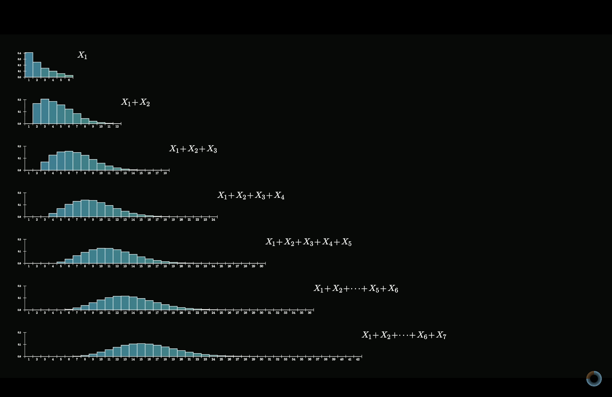
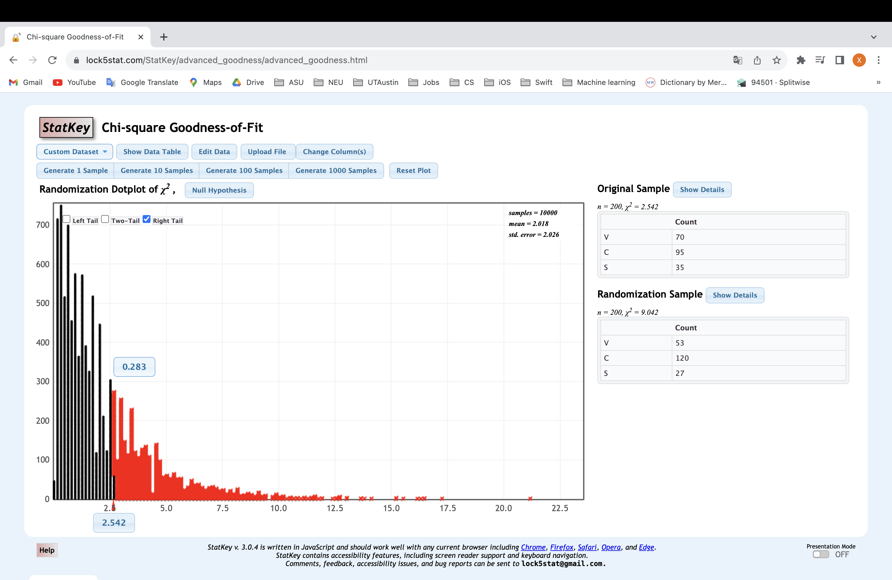
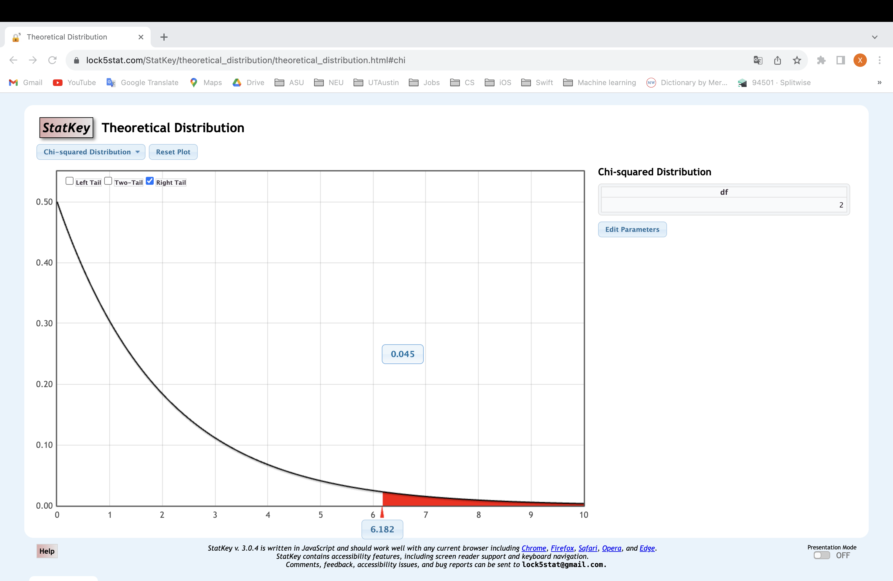

# DSC381ProbabilityandSimulation-BasedInference

## Table of Contents

4. [Chapter 4 Introduction to Statistical Inference](#chapter-4-introduction-to-statistical-inference)
- [Hypothesis Testing](#hypothesis-testing)
- [Confidence Interval](#confidence-interval)
- [HW 4 Solutions](#hw-4-solutions)

10. [Chapter 10 Inference with Simulation: Details](#chapter-10-inference-with-simulation-details)

11. [Chapter 11 Inferential Statistics with Theoretical Distributions](#chapter-11-inferential-statistics-with-theoretical-distributions)
- [General Idea of the Central Limit Theorem](#general-idea-of-the-central-limit-theorem)
- [Central Limit Theorem Visualizations](#central-limit-theorem-visualizations)
- [Central Limit Theorem Formula Sheets](#central-limit-theorem-formula-sheets)
- [Confidence Interval z* Scores](#confidence-interval-z-scores)
- [Derive Sample Size Formula](#derive-sample-size-formula)
- [HW 10 Solutions](#hw-10-solutions)
- [11.7 Goodness of Fit Test](#117-goodness-of-fit-test)

## Chapter 4 Introduction to Statistical Inference

| Term                | Description         |
|---------------------|---------------------|
| "p-hat" (p̂)         | Represents the sample proportion or sample probability of success. In experiments, you calculate p-hat as the number of successes. |
| "p"                 | Represents the population proportion or population probability of success. In many cases, you may be interested in making inferences about a larger population based on the sample data you've collected. However, you typically don't know the true population proportion (p) because you're working with a sample, so you estimate it using p-hat (p̂). |
| Confidence Intervals| Use p-hat (p̂) to estimate p, and you construct an interval estimate for p. This interval gives you a range of values within which you believe the true population proportion (p) is likely to fall. |
| Hypothesis Testing  | Compare p-hat (p̂) to a hypothesized value of p (usually denoted as p0) to determine whether there is evidence to support a particular claim or hypothesis. You typically calculate a test statistic based on p-hat and p0 and then assess whether the observed sample proportion (p-hat) is significantly different from the hypothesized population proportion (p0). |

Summary: p-hat (p̂) is based on sample data and represents the sample proportion, while p (population proportion) is often unknown and represents the parameter you're trying to estimate or test hypotheses about in the larger population.

### Strength of evidence
- Very Strong Evidence (p < 0.01)
- Strong Evidence (0.01 ≤ p < 0.03)
- Moderate Evidence (0.03 ≤ p < 0.07)
- Some Evidence (0.07 ≤ p < 0.1)
- Weak evidence (0.1 ≤ p)

### Explanatory variable and Response variable
- Explanatory Variable (Independent Variable):

The explanatory variable is also known as the independent variable. It is the variable that is manipulated or controlled by the researcher in an experiment or study.

- Response Variable (Dependent Variable):

The response variable is also known as the dependent variable. It is the outcome or result that researchers are interested in understanding or explaining based on the influence of the explanatory variable(s).
It must be correlated with the independent variable. This may be a causal relationship, but it does not have to be.
It must be causally related to the dependent variable.

- Confounding variables: 

Confounding variables (a.k.a. confounders or confounding factors) are a type of extraneous variable that are related to a study’s independent and dependent variables.

A variable must meet two conditions to be a confounder: 
1. It must be correlated with the independent variable. This may be a causal relationship, but it does not have to be. 
2. It must be causally related to the dependent variable.

Example of a confounding variable: 
You collect data on sunburns and ice cream consumption. You find that higher ice cream consumption is associated with a higher probability of sunburn. Does that mean ice cream consumption causes sunburn? 
Here, the confounding variable is temperature: high temperatures cause people to both eat more ice cream and spend more time outdoors under the sun, resulting in more sunburns. 
Link: [Confounding variables example](https://www.scribbr.com/methodology/confounding-variables/)

### generalize to the population and provide evidence

- Generalize to the population: If the subjects in the sample of a study were selected at random from the entire population in question, the results can be generalized to the entire population because random sampling ensures that each individual has the same chance to be selected for the sample.

- Provide evidence: If the subjects in the sample were randomly assigned to treatments, it may be appropriate to make conclusions about cause and effect because the treatment groups will be roughly equivalent at the beginning of the experiment other than the treatment they receive.

Example:

A community center offers a Spanish course. This year, all students in the course were offered additional audio lessons they could take at home. The students who took these additional audio lessons did better in the course than students who didn’t take the additional audio lessons. Based on these results, which of the following is the most appropriate conclusion?

- A Taking additional audio lessons will cause an improvement for any student who takes any foreign language course.
- B Taking additional audio lessons will cause an improvement for any student who takes a Spanish course.
- C Taking additional audio lessons was the cause of the improvement for the students at the community center who took the Spanish course. 
- D No conclusion about cause and effect can be made regarding students at the community center who took the additional audio lessons at home and their performance in the Spanish course

The correct answer is choice D. The better results of these students may have been a result of being more motivated, as shown in their willingness to do extra work, and not the additional audio lessons.

Choice A is incorrect because no conclusion about cause and effect is possible without random assignment to treatments and because the sample was only students taking a Spanish course, so no conclusion can be appropriately made about students taking all foreign language courses.

Choice B is incorrect because no conclusion about cause and effect is possible without random assignment to treatments and because the students taking a Spanish course at the community center is not a random sample of all students who take a Spanish course. 

Choice C is incorrect because the students taking the Spanish course at the community center were not randomly assigned to use the additional audio lessons or to not use the additional audio lessons

## Hypothesis Testing
- The null hypothesis (H0) often represents either a skeptical perspective or a claim of “no difference” to be tested.
- The alternative hypothesis (HA) represents an alternative claim under consideration and is often represented by a range of possible values for the value of interest.

### 11.1 Sex discrimination case study
|  Sex   | Promoted | Not Promoted | Total |
|------- |--------- |------------- |------ |
|  Male  |    21    |      3       |  24   |
| Female |    14    |     10       |  24   |
| Total  |    35    |     13       |  48   |
- p: population proportion
- p̂(p-hat): sample proportion
- μ: population mean
- x̄(X Bar): sample mean
- H0 : Null hypothesis. The variables sex and decision are independent. They have no relationship, and the observed difference between the proportion of males and females who were promoted, 29.2%, was due to the natural variability inherent in the population.
- HA : Alternative hypothesis. The variables sex and decision are not independent. The difference in promotion rates of 29.2% was not due to natural variability, and equally qualified female personnel are less likely to be promoted than male personnel.

Question: How often would you observe a difference of at least 29.2% (0.292)? Often, sometimes, rarely, or never?

Answer: It appears that a difference of at least 29.2% under the null hypothesis would only happen about 2% of the time(StatKey shows 2.5%). Such a low probability indicates that observing such a large difference from chance alone is rare.

- If H0, the Null hypothesis is true: Sex has no effect on promotion decisions, and we observed a difference that is so large that it would only happen rarely.
- If HA, the Alternative hypothesis is true: Sex has an effect on promotion decisions, and what we observed was actually due to equally qualified female candidates being discriminated against in promotion decisions, which explains the large difference of 29.2%.

Result: When we conduct formal studies, we reject a null position

### 11.2 Opportunity cost case study
| Group    | Buy Video | Not Buy Video | Total |
|----------|-----------|---------------|-------|
| Control  |    56     |      19       |  75   |
| Treatment|    41     |      34       |  75   |
| Total    |    97     |      53       |  150  |

| Group    | Buy Video | Not Buy Video | Total |
|----------|-----------|---------------|-------|
| Control  |    0.747  |      0.253    |   1   |
| Treatment|    0.547  |      0.453    |   1   |
- H0 : Null hypothesis. Reminding students that they can save money for later purchases will not have any impact on students’ spending decisions.
- HA : Alternative hypothesis. Reminding students that they can save money for later purchases will reduce the chance they will continue with a purchase.

We can construct a point estimate for this difference as (T for treatment and C for control):
- pˆT −pˆC =34/75−19/75=0.453−0.253=0.200

Result: Under the null hypothesis (no treatment effect), we’d observe a difference of at least +20% about 0.6%(StatKey shows 1%) of the time. That is really rare! Instead, we will conclude the data provide strong evidence there is a treatment effect: reminding students before a purchase that they could instead spend the money later on something else lowers the chance that they will continue with the purchase.

## Confidence Interval
- Statistics: Assuming we have a good description of the experimental data as a r.v.’s, we try to report inference on the parameters, like p etc.

- Confidence Interval: we create what is called a confidence interval, which is a range of plausible values where we may find the true population value. The process for creating a confidence interval is based on understanding how a statistic (here the sample proportion p̂) varies around the parameter (here the population proportion p) when many different statistics are calculated from many different samples.

- Statistic (Sample Proportion - p̂): A statistic is a numerical summary or measurement calculated from a sample of data. In the context of creating a confidence interval, the statistic of interest is the sample proportion (p̂). This is the proportion of a specific characteristic or attribute within a single sample, and it serves as an estimate of the population proportion (p).

- Parameter (Population Proportion - p): A parameter is a numerical value that describes a characteristic of an entire population. In this context, the parameter of interest is the population proportion (p). It represents the true proportion of the characteristic within the entire population, which is often unknown and needs to be estimated using sample data.

- Sample Proportion (p̂): You randomly select 500 residents and ask them if they support the new transportation system. Out of the 500 respondents, 300 say they support it.

p̂ = (Number of supporters in the sample) / (Total sample size)

p̂ = 300 / 500

p̂ = 0.60 (or 60%)

The sample proportion "p̂" is also 0.60 or 60%, indicating that 60% of the sampled residents support the new transportation system.

- Population Proportion (p): This is the proportion of the entire city's population that supports the new public transportation system. Suppose that, in the entire city, 60,000 people support it.

p = (Number of supporters in the entire population) / (Total population)

p = 60,000 / 100,000

p = 0.60 (or 60%)

So, the population proportion "p" is 0.60 or 60%, meaning 60% of the entire population supports the new transportation system.

### 12.1 Medical consultant case study
One consultant tried to attract patients by noting the average complication rate for liver donor surgeries in the US is about 10%, but her clients have had only 3 complications in the 62 liver donor surgeries she has facilitated. She claims this is strong evidence that her work meaningfully contributes to reducing complications

We will let p represent the true complication rate for liver donors working with this consultant. (The “true” complication rate will be referred to as the parameter.) We estimate p using the data, and label the estimate p̂.

The sample proportion for the complication rate is 3 complications divided by the 62 surgeries the consultant has worked on: p̂ = 3/62 = 0.048.

- Parameter: “true” value of interest.

- Statistic: We typically estimate the parameter using a point estimate from a sample of data. The point estimate is also known as the statistic.

For example, we estimate the probability p of a complication for a client of the medical consultant by examining the past complication rates of her clients:

p̂ = 3/62 = 0.048 is used to estimate p

Question: The original claim was that the consultant’s true rate of complication was un- der the national rate of 10%. Does the interval estimate of 0 to 11.3% for the true probability of complication indicate that the surgical consultant has a lower rate of complications than the national average? Explain.

Answer: No. Because the interval overlaps 10%, it might be that the consultant’s work is associated with a lower risk of complications, or it might be that the consultant’s work is associated with a higher risk (i.e., greater than 10%) of complications! Additionally, as previously mentioned, because this is an observational study, even if an association can be measured, there is no evidence that the consultant’s work is the cause of the complication rate (being higher or lower).

## HW 4 Solutions
### Problem 5
With a 90% confidence interval, the proportion of students in the band next year who will be from out-of-area. We will consider the students in the band this year as a random sample from all students who have and will attend the high school and be in the band. This year, there are 63 students in the band, 11 of whom are “out-of-area.”

0.254-0.095=0.159 
Answer:  0.160 
### Problem 6
The population of students this year at Crossroads High School has 14% are classified as being from “out of area.” 
In CrossRoads High School, consider this year’s students varsity football team a random sample from all the school’s varsity football players for 20 years. This year, the varsity football team has 38 students. Of those 9 are from “out-of-area.” Test the hypothesis that the proportion of football players from “out-of-area” over the 20 years is higher than 0.14. Find the p-value.

p-value meaning in here: if the entire population population proportion is 0.14, what is the probability of football team for 20 years is equal or greater than 9/38(0.2368) 
Method: Hypothesis test on a proportion 
H0: p = 0.14 
H0: p > 0.14 
Sample proportion of out of area players = p 
Sample statistic: p̂(p-hat) = 9/38 = 0.236842 
Enter a numerical cutoff value: 0.2368(0.237 will get wrong result) 
0.075 
Answer:  0.068 
### Problem 8
Test the claim that the proportion of people in the population treated with lithium have a higher proportion of non-relapse than those who are not treated (i.e. treated with a placebo in our sample.) Find the p-value for this test. 

p-value meaning in here: if H0 is correct, what is probability of p̂l - p̂p >= 0.083333
Method: Hypothesis test on difference of two independant proportions 
H0: Pl-Pp = 0 
H0: Pl-Pp > 0 
Sample proportion of non-relapse when treated with lithium: 6/24 
Sample proportion of non-relapse when treated with placebo: 4/24 
Sample statistic: p̂l - p̂p = 6/24 - 4/24 = 0.083333 
Answer:  0.36 
Note: The p-value, which is 0.36 in this case, is the probability of obtaining a sample statistic as extreme as the one calculated (0.083333) or more extreme under the null hypothesis. In other words, it tells you how likely it is to observe this difference in proportions if there is truly no difference between the groups. 

### Problem 9
Find an 83% confidence interval for the difference in the proportion of people in the population who are expected to have no relapse between those treated with desipramine and those treated with lithium.

Method: Confidence interval for the difference of independant proportions 
Parameter to estimate: Pd - Pl 
Sample proportion of non-relapse when treated with desipramine: 14/24 
Sample proportion of non-relapse when treated with lithium: 6/24 
0.500 - 0.167 = 0.333 
Answer:  0.35 
Note: 
0.500*24 = 12 
0.167*24 = 4.003 
We can say it is 83% probability that the difference between the proportion of the two kinds of treatment is from 4.003/24 to 12/24. 

### Problem 10
| Term                | Description         |
|---------------------|---------------------|
| "p-hat" (p̂)         | Represents the sample proportion or sample probability of success. In experiments, you calculate p-hat as the number of successes. |
| "p"                 | Represents the population proportion or population probability of success. In many cases, you may be interested in making inferences about a larger population based on the sample data you've collected. However, you typically don't know the true population proportion (p) because you're working with a sample, so you estimate it using p-hat (p̂). |
10.i The bootstrap distribution(used for a confidence interval) of the sample statistic p-hat is centered at value of p-hat from the sample  | 
10.ii The sampling distribution of the sample statistic p-hat is centered at the population parameter p  | 
10.iii The randomization distribution(used for a hypothesis test) used to test hypotheses about the value of the population proportion is centered at the value of p in the null hypothesis  | 

Example(Hypothesis Test): 60% of all college students are women. Now consider us taking a sample of UT Austin students and we get that the proportion of female students is 54%. Now suppose we want to use the randomization test to test the claim that the true proportion of women at UT Austin is less than 0.6, which is a reasonable choice for p given what we know about the country-wide proportion but may not hold at UT Austin specifically. In this example, p=0.6, and like you said the randomization test distribution is centered at 0.6, but the true proportion of women at UT Austin is not known, and in fact were it known there would be little point in doing this test.

## Chapter 10 Inference with Simulation: Details
### Does light at night affect mice’s weight gain? (hypothesis test)

1. Chose a randomization method (Shift groups) 
2. Generated MANY replications (4000). 
3. Chose to do a two-tailed test. 
4. Put the value of the test statistic (difference of the two sample means) on the horizontal axis. 
5. Read the p-value to be 2(0.0055)=0.011 

**Interpretation of result:** It is very unlikely to happen if Ho is true 

**Conclusion:** The data give quite strong evidence (p=0.011) that there is a difference in average weight gain between mice who are exposed to light at night and those who were not. 

**Conclusion (Statistical Significance):** 
1. Choose a cut-off value for how small the p-value has to be to decide to act on the alternative hypothesis. 
2. Decide: Reject Ho and act on Ha if the p-value is smaller than that cut-off. 

Note: p-value is the probability of obtaining a test statistic as extreme as, or more extreme than, the one observed in the sample data, assuming that the null hypothesis is true.

**Several issues can be discussed here:** 
1. Why was this a two-sided test? 
• I approached this dataset without an opinion about whether or how a change in the light conditions for mice would result in a change in their weight gain.
(Possibly the researcher had an opinion and did a one-sided test.) 
• Without a reason to believe one direction or another, it was most reasonable to simply test whether there is difference. 
2. How would one choose a cut-off value? 
• When making a decision to DO something, there are always two possible errors that can be made, with different consequences. 
• Error: Reject Ho when Ho true. (Called a Type I error.) 
• Error: Fail to reject Ho when Ha is true. (Called a Type II error.) 
• There is a “trade-off” between making the two possible types of error. 
• The appropriate way to choose a cut-off value is for the person who will eventually make the decision to make a judgment about how to balance the negative impact of the consequences of each type of error. 
• In a given field, there may be a customary cut-off level used, based on judgment of many people about the relative “cost” of the consequences. 
• This “cut-off” value for the p-value is called the “significance level.” 
3. Why did I choose this randomization method? 
• First, in most situations any of the three methods will give similar results. 
• Having a choice mainly illustrates that there is not just one way to do it. 
• Here, I chose this method because, if the “treatment” (light exposure) changes not only the mean but the variability in weight gain, this method preserves the different variability in the different groups. 

### Student Smokers (hypothesis test)

The p-value is 2(0.124) = 0.248 
**Interpretation of result:** The actual data we observed is not at all far out in the tails of this dist’n, so it is reasonably likely to happen if Ho is true. 
**Conclusion:** The p-value for this hypothesis test is 0.248, which is not at all small. Data values this extreme could easily happen by chance alone if there is no real difference in the population proportions of smokers. 

### Mustang Price dataset (confidence interval)

### Manhattan Apts. Rent dataset (confidence interval)

### Very Small Proportion dataset (confidence interval)

### Median of Mustang Price dataset (confidence interval)

### Median of Manhattan Apts. Rent dataset (confidence interval)

### Standard Deviation of Body Temperature dataset (confidence interval)

### Standard Deviation of Car Depreciation Data (confidence interval)

## Chapter 11 Inferential Statistics with Theoretical Distributions
### General Idea of the Central Limit Theorem
**1. Start with a random variable: X **
Example: Roll a dice get 6 results 
**2. Add N samples of this variable **
X1 + X2 + X3 + ... + Xn 
Example: Roll the dice multiple times to get the sum of multiple results 
**3. The distribution of this sum looks more like a bell curve as N -> ∞ **

**For larger and larger sums, it looks like more and more like a bell curve and more spread out **

### Central Limit Theorem Visualizations
http://visualize.tlok.org/intro-stat/central_limit.php

### Central Limit Theorem Formula Sheets
**Theoretical Sampling Distribution:** The term "theoretical" emphasizes that this distribution is based on mathematical principles and assumptions about the population. 

**Test Statistic:** The test statistic is a numerical summary of the information in a sample that is used to make inferences about a population parameter. 

### Confidence Interval z* Scores
**For a normal dist’n, the middle 90% is bounded by **
center – 1.645 * standard deviation 
center + 1.645 * standard deviation 

**For a normal dist’n, the middle 95% is bounded by **
center – 1.960 * standard deviation 
center + 1.960 * standard deviation 

**For a normal dist’n, the middle 97% is bounded by **
center – 2.170 * standard deviation 
center + 2.170 * standard deviation 

**For a normal dist’n, the middle 99% is bounded by **
center – 2.576 * standard deviation 
center + 2.576 * standard deviation 

### Derive Sample Size Formula
Standard deviation: standard deviation of the data. 
Standard error: standard deviation of the sampling distribution. 

## HW 10 Solutions
### Problem 11
**The manufacturers are interested in estimating the percentage of defective light bulbs coming from a certain process. They want a 97% confidence interval with a margin of error of 3.6%. How many light bulbs must they test? **
n = ((Z/E)^2)*p*(1-p) 
n = required sample size 
Z = Z-score (corresponding to the desired confidence level, e.g., 1.96 for a 95% confidence level) 
p = estimated proportion of the population (if unknown, use 0.5 for the most conservative estimate) 
E = margin of error 

n = ((2.170/0.036)^2)*(0.5)(1-0.5) = 908.353 

### Problem 12
**Same question as in the previous problem, but assume they had a reason to believe the proportion is fairly close to 7%. How many light bulbs must they test? **
n = ((2.170/0.036)^2)*(0.07)(1-0.07) = 236.5350 

### Problem 13
**An airline has a regular flight between two cities. From a previous study, we estimate the standard deviation of the flight times to be 8.34 minutes. We want a 90% confidence interval for the average flight time with a margin of error of 2.5 minutes. How many flights must they include in the study to find that confidence interval? **
n = (1.645*8.34/2.5)^2 =  30.115  which means we need 31 

### Problem 14
**Is the design of this study appropriate to provide evidence about causality? **
The statement of the problem said that the subjects were randomly assigned. So Yes. 

### Problem 15
**Carry out a simulation procedure and report the p-value. **

Hypothesis test for the difference of two independent means. 
Let mu_T - mu_P = difference in mean between the sample who drank tea and those who did not drink tea. 
Ho: mu_T - mu_C  = 0 
Ha: mu_T - mu_C  >  0 
Sample statistic: difference in the two sample means = 17.12 
Simulation: 1000 replications for five times: 0.026, 0.031, 0.022, 0.033,  0.021 

### Problem 17
**They want to estimate the difference in the average age of married women and the average age of married men in marriages between a woman and a man. Which of these is the correct method of analysis? **
Confidence interval for a difference of independent means

### Problem 18
**From the data from the survey, they will estimate the average difference in the ages of the woman and man in a married couple in the population from which the sample is drawn. Which of these is the correct method of analysis? **
Confidence interval for the difference in means from matched pairs

## 11.7 Goodness of Fit Test
**Compute the Test Statistic(Chi-Square Goodness of Fit Test): **
(Observed - Expected)^2/(Expected) = (Observed - Expected)/(Expected)*(Observed - Expected) 
Note: get proportions first, and know how many counts there were. 

**Here’s the formula for the test statistic: **
X^2 = Σ(Observed - Expected)^2/(Expected)

**Example: Ice cream sales in October **
Sell three flavors of ice cream: vanilla, chocolate, and strawberry. 
Last October, I sold were 0.30, 0.50, and 0.20 (in that order.) 

When next October is completed, I will be interested in testing the claim that: 
Ho: Next October’s proportions were consistent with the previous October’s proportions 
Ha: Some of the proportions are not consistent with last year’s claim. 

**Degrees of freedom:** 3(number of cells) - 1 = 2 

| Dataset A           |                     | Dataset B           |                     | Dataset C           |                     |
|---------------------|---------------------|---------------------|---------------------|---------------------|---------------------|
| Vanilla             | 60                  | Vanilla             | 70                  | Vanilla             | 76                  |
| Chocolate           | 100                 | Chocolate           | 95                  | Chocolate           | 87                  |
| Strawberry          | 40                  | Strawberry          | 35                  | Strawberry          | 37                  |
| Total               | 200                 | Total               | 200                 | Total               | 200                 |

| Dataset B: p-value from theoretical dist’n    | Dataset B: p-value from Randomization Dist’n  |
|-----------------------------------------------|-----------------------------------------------|
|      |      |

| Dataset C: p-value from theoretical dist’n    | Dataset C: p-value from Randomization Dist’n  |
|-----------------------------------------------|-----------------------------------------------|
|      |      |

<!-- **Dataset B: p-value from theoretical dist’n: **

**Dataset B: p-value from Randomization Dist’n: **

**Dataset C: p-value from Randomization Dist’n: **
 -->